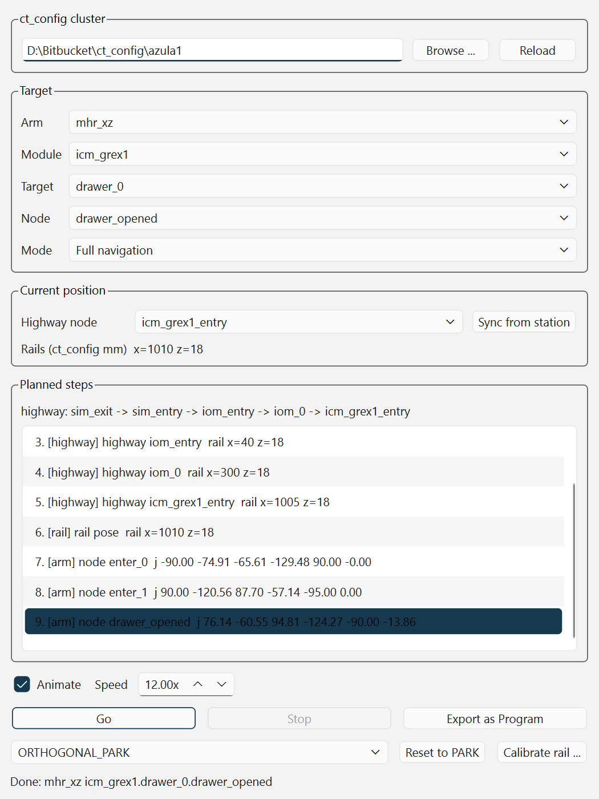

# RoboDK ct_config navigation

Replay [ct_config](https://bitbucket.org/) navigation nodes in RoboDK. Pick a cluster,
arm, module, target and node in a panel, and the matching arm in the station performs the
real MHR navigation: retract to its park pose, travel the rail highway, move to the
target's rail position, then walk down the arm tree to the chosen node and — for a
pick or place — reverse the same chain back to park.

Built as a RoboDK App (toolbar button + panel), with the navigation model in a
RoboDK-free library so it can be tested against the real config without a station open.



## What it does

| Piece | Where it comes from |
| --- | --- |
| Rail waypoints and routing | `<arm>/cluster_config.yaml` `highway_tree` |
| Target rail position and arm tree | `<arm>/cluster_config.yaml` `arm_nav_trees` |
| Joint poses per node | `<arm>/navigation/<file>.yaml` `trees.<tree>.<node>.pose` |
| Which park pose table applies | `<arm>/ur10e.yaml` / `ur12e.yaml` `location` |
| Rail travel limits | `<arm>/x_rail.yaml` / `z_rail.yaml` `travel_bounds` |
| Park pose joint values | Not in ct_config; see [Park poses](#park-poses) |

Three playback modes, which only change how the rails get there:

- **Full navigation** (default) — park, then every highway hop from the arm's current
  node to the target's, then the target's rail pose, then the arm tree walk.
- **Arm tree only** — park, one rail move straight to the target, then the arm tree walk.
- **Jump to end pose** — a single step to the final rail position and joint pose.

Independently, a visit chooses which half of the arm tree to play:

- **Enter only** (panel default) — stop at the selected node, for inspecting a pose.
- **Pick / place (in and out)** — walk down to the node, then reverse the same parent
  chain back to park. The arm must not stay at a pick/place leaf: the next rail move
  is unsafe with it extended. ``tuck_away`` is the exception — that tree exists so the
  arm *ends* at ``tucked_away``.
- **Exit only** — assume the arm is already at the node and walk back to park.

## Setup

Quit RoboDK first. Then from the repository root:

```bash
# Linux / macOS
python3 scripts/install_app.py -y

# Windows
python scripts/install_app.py -y
```

The installer builds a self-contained copy under `dist/CtNav` and installs it:

- **Windows** — RoboDK install-root `Apps/` (AppLoader) plus `Addins/`, and Enable in
  `AddinManager.ini` when that file already exists. Interpreter discovery is unchanged
  (no `{repo}/.venv`).
- **Linux / macOS** — user-level Add-ins only
  (`~/.local/share/RoboDK/Addins` on Linux,
  `~/Library/Application Support/RoboDK/Addins` on macOS). It does not write into
  `RoboDK.app`. Runtime deps go in `{repo}/.venv`, created with the `python3` that
  ran the installer (3.9+).

If RoboDK has never been opened on this account, it has not written `settings.ini` /
`AddinManager.ini` yet. Open it once, quit fully, then re-run the same command. With
those files present, `-y` writes the interpreter **absolute** path into
`Path_PythonRun` / `Path_PythonRun2` and enables the Add-in.

Restart RoboDK afterwards. Confirm `Tools > Options > Python > Python interpreter`
still shows that absolute path.

Re-run `python3 scripts/install_app.py --sync` after changing code (`--sync` implies
`-y`).

Linux / macOS toolbar click has **not** been verified on a real RoboDK in this pass.
The installer paths, venv, and ini writes are covered by tests. If the CtNav button
does nothing after a successful install, it is still the traps below.

`--python /path/to/python` skips `.venv` and installs deps into that interpreter
instead. On Linux that will fail if pip refuses an externally-managed environment;
omit `--python` and let the installer use `{repo}/.venv`.

### Two environment traps

Both were diagnosed in the sibling [Robodk_Auto_Attach](https://github.com/) project and
apply here unchanged:

1. **The interpreter path must be absolute.** RoboDK spawns Action scripts with a minimal
   `PATH`, so a bare `python` resolves to nothing, the script never starts, and no error
   is shown — the toolbar button just appears dead. Type the full path in; the `Select...`
   picker only offers bare command names.
2. **Anaconda base usually cannot load PySide6.** conda's Qt5 (`qt-main` / `pyqt`) shadows
   a pip-installed PySide6 and `from PySide6 import QtCore` fails with
   `DLL load failed ... the specified procedure could not be found`. Use a standalone
   CPython; `install_app.py` probes for one on Windows and warns if the chosen
   interpreter is broken. On Linux the same import fails when `libxcb-cursor0` (and
   related) packages are missing — the installer prints the `apt`/`dnf` line and exits
   non-zero.

On Linux, `python3 -m venv` failing usually means `sudo apt install python3-venv`. On
macOS, do not use the Apple `/usr/bin/python3` stub; install 3.9+ from python.org or
Homebrew and invoke that `python3`.

`-y` / `--sync` updates whichever of `Path_PythonRun` / `Path_PythonRun2` already exists
in RoboDK's `settings.ini` (Windows `%APPDATA%\RoboDK`, macOS
`~/Library/Application Support/RoboDK`, Linux `~/.config/RoboDK` and
`~/.local/share/RoboDK`). It never creates those files. `--write-python-setting` still
does the same without requiring `-y`.

## Using the panel

Open it from the **CtNav** toolbar button, or run it standalone against an open station:

```bash
python -m ct_nav_robodk.ui.panel
```

On Linux / macOS after install, use the venv the installer created:
`{repo}/.venv/bin/python -m ct_nav_robodk.ui.panel`.

- **ct_config cluster** — first existing of `CT_CONFIG_CLUSTER`,
  `~/Bitbucket/ct_config/azula1`, `~/bitbucket/ct_config/azula1`, a `ct_config/azula1`
  sibling of this repo, and on Windows `D:\Bitbucket\ct_config\azula1`. If none exist the
  field starts empty. The choice is remembered between sessions.
- **Arm / Module / Target / Node / Visit** — cascading, populated from the cluster.
  Visit defaults to enter only.
- **Highway node** — where the arm is standing. Full navigation routes the rails from
  here, so it matters. **Sync from station** sets it to the node closest to the rails'
  actual position, which is the right thing to press after jogging the station by hand.
  The panel then tracks it as moves complete, per arm.
- **Planned steps** — the resolved sequence, shown before anything moves. Click a step
  to joint-move the arm there (interpolated at the Speed setting); double-click to jump
  the station straight to it.
- **Go / Stop** — animated playback. Stop halts between interpolation frames, leaving the
  arm part-way through a step rather than snapping to the end of it.
- **Path cubes** — optional, off by default, remembered between sessions. While the
  selected arm moves, CtNav keeps a CAD-hugging cube wrap on each UR link plus the
  currently visible EOAT and cable guard (20 / 40 / 80 mm cubes; the wrap is posed
  to the host each frame so it is still on the arm at the final pose). Rails are
  not wrapped. A coarser unique-cell trail (80 mm, up to 12 000 cells per arm)
  records swept space: stamps are sparse during motion (about every 80 mm or 3
  frames) with interpolation between stamps, and the end pose is always flushed.
  Colours: blue `mhr_xz`, orange `mhr_x`, green `mhr_u1`, violet `mhr_u2`.
  White is unused; red is reserved for hits. **Clear paths** removes the cubes;
  closing the panel does too, so they are not saved into the `.rdk` by accident.
- **Collision** — optional, **off by default**, not turned on with Path cubes. When
  checked, the live wrap is the current-pose geometry and the 80 mm trail cubes are
  the swept-space geometry: if the live wrap or a new trail cube overlaps another entity
  (cell CAD, another robot, or another arm's trail) playback stops where it is. The moving arm's
  own body — and anything already overlapping it when Go starts — is ignored, so the
  first pose does not light up red. This is our own axis-aligned box test, not RoboDK
  `Collisions()`, so it stays light enough to run every interpolation frame. Hidden
  items are ignored.
- **Export as Program** — see [Exported programs](#exported-programs).
- **Reset to PARK** — retracts the arm to the selected park pose without moving the rails.
- **Calibrate rail** — see [Rail calibration](#rail-calibration).
- **EOAT** — tools parented under the selected MHR. **Apply** shows the chosen one,
  hides every other EOAT on that arm, and leaves **CABLE GUARD** visible. This is a
  station-visibility swap (and `setPoseTool` when the item is a Tool), not a physical
  attach; use `Robodk_Auto_Attach` for that. Pick `(none — cable guard only)` to strip
  the flange down to the guard.

## Station mapping

ct_config describes rails as module-frame millimetres and says nothing about how a station
models them. `station_map.yaml` bridges the two, and on NABOO-01 all three possible shapes
occur at once:

| Arm | Station item | Rails |
| --- | --- | --- |
| `mhr_xz` | `MHR-XZ` (7 axes) | z is joint 7; x is a separate 1-axis mechanism `x-axis rail` |
| `mhr_x` | `MHR-X` (7 axes) | x is joint 7 |
| `mhr_u1` / `mhr_u2` | `MHR-U1` / `MHR-U2` (6 axes) | none |

A rail's `kind` is one of `robot_axis` (an extra joint of the arm's own robot),
`mechanism` (a separate item commanded on its own), or `frame` (a plain frame translated
along one axis). `scale` and `offset` convert ct_config millimetres to RoboDK joint values
as `robodk = ct * scale + offset`.

To map a different station, dump its structure and write a map from what you see:

```bash
python scripts/inspect_station.py --filter MHR
python scripts/inspect_station.py --json station_dump.json
```

Then check the map fits before trusting it:

```bash
python scripts/validate_station.py
```

That drives a curated set of targets and compares the station's rails against
`cluster_config.yaml` and its joints against the tree YAML. Add `--all-arms` to cover one
target per arm/module pair, and `--mode arm_only` / `--mode jump` to check the other modes.

### Rail calibration

Every rail on NABOO-01 is identity-mapped, because RoboDK's joint limits already match
ct_config's `travel_bounds` exactly (z 0–840 mm, `mhr_x` x 0–9365 mm). If a rail on another
station has a different zero, jog it to a position whose ct_config value you know, press
**Calibrate rail**, and enter that value. The panel solves for `offset` and writes
`station_map.local.yaml`, which is gitignored and takes precedence over the tracked map,
so a per-machine calibration never has to be committed. `build_package.py` vendors the
local map in preference to the tracked one when building the App.

## Park poses

Every root node in a navigation tree names a park pose as its `parent`
(`ORTHOGONAL_PARK`, `PARALLEL_UP_PARK`, `PARALLEL_DOWN_PARK`, `WRIST_UP_PINS_DOWN`), but
ct_config never defines their joint values. They live in the MHR software, and are
reproduced in `ct_nav/park_poses.py` from the `REFERENCE_POSES` table in
`non_prod_tool/Nodes_transfer_app/index_v2.html` — the tool the navigation nodes are
authored with. Which of the two tables applies depends on the arm's `location`
(`lower` / `upper`).

A park pose has no base angle of its own. Navigation parks and **Reset to PARK** both
use the arm's ``park_base_angle`` from ``ur*.yaml`` — typically -90° on lower arms
(`mhr_xz`, `mhr_x`) and +90° on upper arms (`mhr_u1`, `mhr_u2`) — so the arm travels
the rails in the same tucked J1 as a manual reset.

## Exported programs

**Export as Program** creates joint targets plus a program under a
`CtNav <arm> Targets` frame, from the same step list the live playback uses. Re-exporting
the same target replaces the previous program rather than piling up.

Every target is absolute, and joints a step does not command are filled from the plan's
own first commanded value rather than the station's current state, so the program can be
run from any starting position and reproduces the same motion.

One RoboDK limitation shows through: a program's instructions all belong to a single
robot, so a rail modelled as a separate mechanism (`mhr_xz`'s x rail) cannot be
interleaved into the arm's program. Those arms get a companion `[x-rail]` program plus
comment instructions in the main program recording the value the rail should hold at each
step. Rails carried as an extra joint of the arm need none of this — they are part of
every joint target.

## Layout

```
ct_nav/                        pure Python, no robodk import
  units.py                     "8240 mm" / "-90.0 deg" -> float
  config.py                    ClusterConfig / ArmConfig loaders
  park_poses.py                the park pose tables and the base-angle rule
  planner.py                   highway routing + arm chain -> MoveStep list
  cluster_paths.py             find azula1 without a hardcoded D:\\ path
ct_nav_robodk/                 RoboDK bindings
  connection.py                Robolink with a timeout a 600 MB station survives
  station_map.py               station_map.yaml load / save / calibrate
  driver.py                    live playback via setJoints
  path_geom.py                 colour-block meshes, bone samples, downsampling (no robodk)
  path_trace.py                CAD-hug live wrap + coarse swept trail (no rails)
  collision.py                 our AABB cube-vs-entity test (no RoboDK Collisions())
  program_export.py            targets + program generation
  ui/panel.py                  the PySide6 panel
roboapp/CtNav/                 App shell (manifest.xml, AppConfig.ini, CtNavPanel.py, svg)
scripts/
  inspect_station.py           dump a station's items, DOF and joint limits
  validate_station.py          drive targets and check the station against ct_config
  spike_path_collision.py      time Collisions() / JointPoses on the open station
  build_package.py             build a self-contained App under dist/
  install_app.py               install / sync into the local RoboDK
station_map.yaml               verified map for NABOO-01
tests/                         pytest, run against the real azula1 checkout
```

`planner.py` emits a flat `list[MoveStep]`, each carrying an absolute rail target and/or
six joint angles. Both the driver and the exporter consume that same list, so preview and
export cannot diverge.

## Tests

```bash
python -m pytest tests/ -q
```

The config and planner tests run against the real `azula1` checkout rather than fixtures,
since consuming that config as-authored is the whole point — a fixture would drift and
stop catching schema surprises. They skip if the checkout is absent; point them elsewhere
with `CT_CONFIG_CLUSTER`.

## Not covered

`calibration/*_arm_locations.yaml` (Cartesian TCP offsets) are out of scope. Path &
collision is a lightweight cube-vs-entity stop, not a motion planner: it does not
rewrite navigation or route around obstacles.
Physical EOAT attach/detach is handled separately by the
`Robodk_Auto_Attach` App; CtNav only toggles which EOAT CAD is visible on each MHR.
